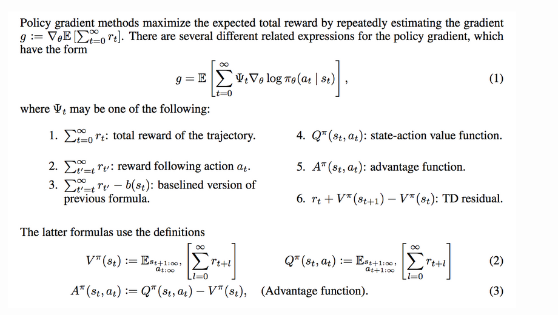
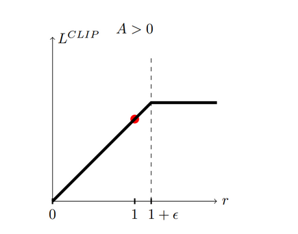
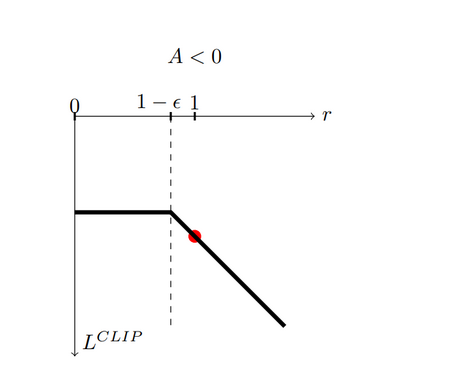

# Blog 05: Policy Gradient, TRPO, PPO and GRPO

## Motivation

I wrote this blog as I was trying to understand the algo, math and code behind the GRPO and PPO. The main goal is to recreate the aha moment from the deepseek r1 paper. This is a two part series blog. Part one covers the alogirthms and math behind the PPO and GRPO, understand the core ideas, the math that drives them, and why GRPO works the way it does. In part two I am going to fine tune a pre trained LLM using GRPO to recreate the "aha Moment" from deep seek R1 from scratch. So, yeah, we are going to reap the rewards in part II.

## Introduction

The RL setup is like this, we have an agent in an environment which is trying to achieve a goal, it takes action $a_t$ in a state $s_t$ according to a policy $\pi_\theta(a_t\mid s_t)$, which is parametrized by $\theta$, according to the actions it receives a reward $s_t$. For example the agent can be a robot trying to learn to walk. Here the enviroment is the surface it is trying to walk on, actions are signal sent to the leg actuators, and the state is the current rotation of its joints, its balance, position, and any sensor readings that describe its posture at time $t$.

Each time the robot takes an action, it transitions to a new state and receives a reward maybe a positive reward for moving forward, or a negative one if it falls over. Over many trials, the goal of reinforcement learning is to adjust the parameters $θ$ so that the policy $π_θ$ produces actions, these can be new action(exploration) or an already taken action (explotation), that maximize the robot’s cumulative reward.  

### Understanding Rewards

In most reinforcement learning problems, we define the return(rewards) from time step $t$ as:

$$
G_t = \sum_{k=0}^{T-t-1} \gamma^k r_{t+k}
$$

The term $\gamma$ (the **discount factor**) plays a very important role. It tells the agent *how much it should care about the future* compared to immediate rewards.

#### Why Do We Use a Discount Factor?

There are a few reasons why discounting is used:

1. **Mathematical stability**  
   When $\gamma < 1$, infinite-horizon sums remain finite.

3. **Myopic vs. Far Sighted Behavior**  
   The discount factor also controls how far into the future the agent should plan. When $\gamma = 0$, the agent becomes completely **myopic**  it only cares about the immediate reward, ignoring all future consequences. This can be useful in some settings, but it usually prevents the agent from learning long-term strategies.

   When $0 < \gamma < 1$, the agent becomes **far-sighted**. It values future rewards, though slightly less than immediate ones. In this regime, the optimal behavior often involves taking actions that may not yield the highest reward right now but lead to significantly better outcomes later. This is essential in tasks where delayed gratification or strategic planning matters, such as navigation, robotics, or games where early sacrifices lead to long-term wins.

#### What if $\gamma = 1$?

Sometimes we drop discounting entirely and set:

$$
\gamma = 1
$$

This makes all rewards equally important, no matter how far in the future they occur. This is perfectly valid when:

- episodes naturally end (e.g., games, tasks with a fixed horizon),
- we care about total cumulative reward without bias toward earlier steps.

In episodic environments, $\gamma=1$ works fine because $T$ is finite  the return still has a well-defined sum.

#### What if the Episode Never Ends?

Some environments do not have a natural terminal state  for example, many continuous control tasks or real-world robotics. These are called **infinite-horizon** environments.

In such cases, discounting is *necessary* unless we impose some artificial limit, because:

- the return $G_t$ would otherwise be an infinite sum,
- gradients become unstable,
- To make agent scarifice immediate reward for overall better return.

Thus for infinite-horizon RL:

- We typically use $0 < \gamma < 1$  
- Or we truncate the trajectory after a fixed number of steps.   

In reinforcement learning, especially when we talk about policy gradient methods, we usually assume an **episodic** setting. That is the after some time the agent can no longer perform actions, think of it as a game coming to end after the player health runs out or time runs out. 

A trajectory of length $T$ can be written as:

$$
\tau = (s_0, a_0, r_0,\; s_1, a_1, r_1,\; \ldots,\; s_{T-1}, a_{T-1}, r_{T-1}, s_T)
$$

Here:

- $s_0$ is sampled from the starting state distribution.
- Each action $a_i$ is drawn from the policy $\pi_\theta(a_i \mid s_i)$.
- The next state $s_{i+1}$ is sampled from the environment dynamics $P(s_{i+1} \mid s_i, a_i)$.

We don't normally have access to the transistion dynamics $P(s_{i+1} \mid s_i, a_i)$. 

The Objective of Policy Gradient Methods is to adjust the $\theta$ of the $\pi_\theta$ to get high rewards, in other words the agent should take optimal actions. The cost function is:

$$
J(\theta) = \max_\theta\; \mathbb{E}_{\tau \sim \pi_\theta} \left[ \sum_{t=0}^{T-1} \gamma^t r_t \right]
$$

This expectation emphasizes that the return depends on trajectories sampled from the current policy $\pi_\theta$.

### Notations 

I will explain each term in the notation as and when it is introduced.
| **Symbol** | **Meaning** |
|-----------|-------------|
| $s \in \mathcal{S}$ | States. |
| $a \in \mathcal{A}$ | Actions. |
| $r \in \mathcal{R}$ | Rewards. |
| $S_t, A_t, R_t$ | State, action, and reward at time step $t$ of a trajectory. Sometimes written as $s_t, a_t, r_t$. |
| $\gamma$ | Discount factor; penalizes uncertainty in future rewards; $0 < \gamma \le 1$. |
| $G_t$ | Return; discounted future reward: $G_t = \sum_{k=0}^{\infty} \gamma^k R_{t+k+1}$. |
| $P(s', r \mid s, a)$ | Transition probability of arriving at state $s'$ with reward $r$ after taking action $a$ in state $s$. |
| $\pi(a \mid s)$ | Stochastic policy (agent behavior); $\pi_\theta(\cdot)$ is a policy parameterized by $\theta$. |
| $\mu(s)$ | Deterministic policy; sometimes written as $\pi(s)$. |
| $V(s)$ | State-value function: expected return from state $s$. $V_w(\cdot)$ is a value function parameterized by $w$. |
| $V^\pi(s)$ | State-value under policy $\pi$: $V^\pi(s) = \mathbb{E}_\pi[G_t \mid S_t = s]$. |
| $Q(s, a)$ | Action-value function: expected return from state–action pair $(s, a)$. $Q_w(\cdot)$ is parameterized by $w$. |
| $Q^\pi(s, a)$ | Action-value under policy $\pi$: $Q^\pi(s, a) = \mathbb{E}_\pi[G_t \mid S_t = s, A_t = a]$. |
| $A^\pi(s, a)$ | Advantage function under policy $\pi$: $A^\pi(s, a) = Q^\pi(s, a) - V^\pi(s)$. Measures how much better an action is compared to the average value of the state. |

## Policy Gardient Algo derivation

If you're familiar with gradient descent, the update rule here is the same idea. We want to adjust the policy parameters in the direction that increases our objective:

$$
\theta \leftarrow \theta + \alpha \nabla_\theta J(\theta)
$$

where $J(\theta)$ is:
$$
J(\theta) = \max_\theta\; \mathbb{E}_{\tau \sim \pi_\theta} \left[ \sum_{t=0}^{T-1} \gamma^t r_t \right]
$$

The main challenge  is to compute the gradient and to estimate it from sampled trajectories. Since the objective depends on the transistion dynamics $P(s_{i+1} \mid s_i, a_i)$, we cannot directly compute the gradient. 

### Policy Gradient: step-by-step derivation

Lets derive the gradient of the objective step by step:

$$
\theta \leftarrow \theta + \alpha \nabla_\theta J(\theta),
\qquad
J(\theta) \;=\; \mathbb{E}_{\tau\sim\pi_\theta}\Big[\sum_{t=0}^{T-1}\gamma^t r_t\Big].
$$

Let $p_\theta(\tau)$ be the probability of trajectory $\tau$ 

$\tau = (s_0, a_0, r_0, s_1, a_1, r_1, \ldots, s_{T-1}, a_{T-1}, r_{T-1}, s_T)$

under policy $\pi_\theta$ (including the start-state distribution and environment dynamics). Then

$$
J(\theta) = \int p_\theta(\tau)\, R(\tau)\, d\tau,
\qquad
R(\tau)\equiv\sum_{t=0}^{T-1}\gamma^t r_t.
$$

Differentiating under the integral :

$$
\nabla_\theta J(\theta)
= \nabla_\theta \int p_\theta(\tau) R(\tau)\,d\tau
= \int \nabla_\theta p_\theta(\tau)\, R(\tau)\, d\tau.
$$

Applying the log-derivative trick, Using $\nabla_\theta p_\theta(\tau) = p_\theta(\tau)\, \nabla_\theta \log p_\theta(\tau)$ to rewrite the gradient as an expectation:

$$
\nabla_\theta J(\theta)
= \int p_\theta(\tau)\, \nabla_\theta \log p_\theta(\tau)\, R(\tau)\, d\tau
= \mathbb{E}_{\tau\sim p_\theta} \big[ R(\tau)\, \nabla_\theta \log p_\theta(\tau)\big].
$$

Lets expand the  $p_\theta(\tau)$,   

$$
p_\theta(\tau) = \mu(s_0)\prod_{t=0}^{T-1}\pi_\theta(a_t\mid s_t)\, P(s_{t+1}\mid s_t,a_t),
$$

What this means is that we start at a state $s_0$ whose probability is given by $\log\mu(s_0)$, from here we take actions according to our policy, then  move to a new state whose probability is given by transition dynamics and again take action and so on. Taking $log$

$$
\log p_\theta(\tau) = \log\mu(s_0) + \sum_{t=0}^{T-1}\log\pi_\theta(a_t\mid s_t)
+ \sum_{t=0}^{T-1}\log P(s_{t+1}\mid s_t,a_t).
$$

Only the policy terms depend on $\theta$. Therefore the gradient simplifies to

$$
\nabla_\theta \log p_\theta(\tau)
= \sum_{t=0}^{T-1} \nabla_\theta \log\pi_\theta(a_t\mid s_t).
$$

(The gradients of $\mu$ and $P$ are zero w.r.t. $\theta$.)

Substituting it into the expectation gives:

$$
\nabla_\theta J(\theta)
= \mathbb{E}_{\tau\sim\pi_\theta}\left[ R(\tau)\, \sum_{t=0}^{T-1} \nabla_\theta \log\pi_\theta(a_t\mid s_t)\right].
$$

We have a working formula and algo. But this has high variance because
   - We are summing the whole reward and multiplying it with the sum of all the log of actions taken. 
   - If we take the same actions again, we might end up in different states depending upon the transistion dynamics, and in return we might get different rewards. 
   - $\pi_\theta(a_t/s_t)$ is a probability, And summinng from t = 0 and t = T will have high variance. Same goes for reward.
   - Also we won't know whether a particular action is good or bad, only if all the combination of actions is good or bad.
So, in practice this always fails. All the algorithm you see is a way to reduce the variance.

Using the reward-to-go (causality) to reduce variance, Because actions at time $t$ cannot affect rewards received *before* $t$, we can replace the full return $R(\tau)$ by the *reward-to-go* from time $t$:

$$
G_t \;=\; \sum_{k=t}^{T-1}\gamma^{k-t} r_k.
$$

Reordering the sums yields the commonly used form

$$
\boxed{\;
\nabla_\theta J(\theta) \;=\; \mathbb{E}_{\tau\sim\pi_\theta}\Big[ \sum_{t=0}^{T-1} \nabla_\theta\log\pi_\theta(a_t\mid s_t)\; G_t \Big]
\;}
$$

This is the REINFORCE (Monte-Carlo policy gradient) estimator. Intuitively: if the return *after* action $a_t$ was high, increase the log-probability of $a_t$.

### Variance reduction with a baseline
We can subtract any baseline $b(s_t)$ from $G_t$ which only depends on state does not depend on $a_t$ without introducing bias:

$$
\nabla_\theta J(\theta)
= \mathbb{E}\Big[\sum_{t} \nabla_\theta\log\pi_\theta(a_t\mid s_t)\,(G_t - b(s_t))\Big].
$$

Subtracting a baseline $b(s_t)$ does **not** change the expected value of the gradient, because the baseline term has **zero expectation**.  
This means it reduces **variance** but does **not** change the mean  so it introduces **no bias**.

Lets see how,

$$
\mathbb{E}\left[\, \nabla_\theta \log \pi_\theta(a_t \mid s_t)\; b(s_t) \,\right].
$$

Because the baseline $b(s_t)$ depends only on the state and not the action, we treat it as a constant with respect to the policy’s action distribution:

$$
= b(s_t)\, \mathbb{E}\left[\, \nabla_\theta \log \pi_\theta(a_t \mid s_t) \,\right].
$$

Now evaluating the inner expectation would give us,

$$
\mathbb{E}_{a \sim \pi_\theta}
\left[\, \nabla_\theta \log \pi_\theta(a \mid s) \,\right]
= 
\nabla_\theta \sum_a \pi_\theta(a \mid s)
=
\nabla_\theta 1
= 0.
$$

Therefore:

$$
b(s_t)\, \mathbb{E}\left[ \nabla_\theta \log \pi_\theta(a_t \mid s_t) \right]
=
b(s_t)\cdot 0
= 0.
$$

So the baseline term disappears:

$$
\mathbb{E}\left[\, \nabla_\theta \log \pi_\theta(a_t \mid s_t)\, b(s_t) \,\right] = 0.
$$

Therfore, Subtracting a baseline does **not** change the expected gradient:

$$
\mathbb{E}\left[
\nabla_\theta \log \pi_\theta(a_t \mid s_t)\, G_t
\right]
=
\mathbb{E}\left[
\nabla_\theta \log \pi_\theta(a_t \mid s_t)\, (G_t - b(s_t))
\right].
$$

#### What this means

- The **mean** of the gradient estimator stays the same → **no bias**  
- The **variance** becomes much lower when $b(s_t)$ is a good estimate of expected return  
- This is why actor–critic methods use a learned value function $V(s_t)$ as the baseline(I have not said what a value function and action value functions are, this is a good time to introduce it.)   

## Value Functions, Action-Value Functions And Advantage Funtion

Since we introduced the baseline $b(s_t)$ and mentioned that a good choice is the expected return from a state, this is a natural time to define two fundamental concepts in reinforcement learning: the **value function** and the **action-value function**.

### State Value Function  $V^\pi(s)$

The **value function** measures how good it is for the agent to be in a specific state $s$ while following policy $\pi$.

It is defined as the expected return starting from state $s$:

$$
V^\pi(s) = \mathbb{E}_\pi \left[\, G_t \mid s_t = s \,\right].
$$

In words:  
**$V^\pi(s)$ is the expected total discounted reward the agent will get in the future if it starts in state $s$ and continues following policy $\pi$.**

This is often used as a **baseline** to reduce variance in policy gradient methods.

### Action-Value Function  $Q^\pi(s, a)$

The **action-value function** measures how good it is to take action $a$ in state $s$ while following policy $\pi$ thereafter.

It is defined as:

$$
Q^\pi(s, a)
= 
\mathbb{E}_\pi \left[\, G_t \mid s_t = s,\, a_t = a \,\right].
$$

In words:  
**$Q^\pi(s, a)$ is the expected return if we start in state $s$, take action $a$, and then follow policy $\pi$ for all future steps.**

### The Advantage Function  $A^\pi(s, a)$

The **advantage function** tells us how much better (or worse) an action is compared to the average action in that state (according to the policy).

It is defined by subtracting the value function from the action-value function:

$$
A^\pi(s, a) = Q^\pi(s, a) - V^\pi(s).
$$

Interpretation:

- If $A^\pi(s, a) > 0$ →  
  Taking action $a$ in state $s$ is **better** than what the agent usually does.

- If $A^\pi(s, a) < 0$ →  
  The action is **worse** than the policy’s average behavior.

- If $A^\pi(s, a) = 0$ →  
  The action is **exactly as good** as the value predicted by the policy.

## Alternate Forms of Policy gradient

Coming back to our equation,   

$$
\nabla_\theta J(\theta)
= \mathbb{E}\Big[\sum_{t} \nabla_\theta\log\pi_\theta(a_t\mid s_t)\,(G_t - b(s_t))\Big].
$$

We can rewrite this in several forms. Taken from [High-Dimensional Continuous Control Using Generalized Advantage Estimation paper](https://arxiv.org/abs/1506.02438) 

Based on my explanations before, I think one has sufficient tools to understand all the forms shown in the image. 

## Trust Region Policy Optimization(TRPO)

Note: I won't derive the TRPO alog, the  [Trust Region Policy Optimization](https://arxiv.org/abs/1502.05477) paper is very well written. What I will do is explain the idea, intuition behind each part and provide the math behind the intuition. **TRPO is neccesary to understand where the idea of PPO and GRPO comes from.**

Policy Gradient methods try to adjust the parameters step by step to obtain good actions, they do this in a straightforward way, if an action leads to a good outcome, "nudge" the policy to make that action more likely.

The problem with this is that with complex, deep neural networks, that "nudge" is unpredictable. A tiny change in the network's parameters (the policy) can lead to a *massive* and sometimes catastrophic change in its behavior. Imagine trying to learn cricket, and one tiny tweak to your swing and you miss the ball.

This is the problem **Trust Region Policy Optimization (TRPO)** set out to solve. While it's largely been succeeded by its simpler cousin, PPO, TRPO's core ideas are fundamental to understanding modern RL.

### The Core Problem: A Step Too Far

Let's start with a key formula from Kakade & Langford (2002). It relates the performance (expected return, $\eta$) of a new policy ($\theta$) to an old one ($\theta_{\text{old}}$):

$$
\eta(\theta) = \eta(\theta_{\text{old}}) + \mathbb{E}_{s \sim \rho_{\pi_{\theta}}, a \sim \pi_{\theta}} [A^{\pi_{\theta_{\text{old}}}}(s, a)]
$$

In plain English: The new policy's performance is the old policy's performance *plus* the average **Advantage** of the new policy's actions.

The **Advantage function** ($A$) as we saw before is just, How much better is this specific action ($a$) in this state ($s$) than the average action I would normally take?

$$
A^{\pi}(s, a) = Q^{\pi}(s, a) - V^{\pi}(s)
$$

This formula looks great! To improve our policy, we just need to maximize that second term.

**But there's a catch.** Look at the expectation $\mathbb{E}_{s \sim \rho_{\pi_{\theta}}, a \sim \pi_{\theta}}$. To calculate this, we need to sample states and actions from the *new* policy... which we don't have yet! It's a chicken-and-egg problem.

### The TRPO Trick: A Local Approximation

TRPO's first big idea is an approximation. What if the new policy is *not very different* from the old one?

If they are close, we can assume the states they visit will also be similar. This lets us swap the state distribution ($\rho_{\pi_{\theta}}$) with the *old* one, which we *can* sample from:

$$
\eta(\theta) \approx \eta(\theta_{\text{old}}) + \mathbb{E}_{s \sim \rho_{\pi_{\theta_{\text{old}}}}, a \sim \pi_{\theta}} [A^{\pi_{\theta_{\text{old}}}}(s, a)]
$$

This is our **surrogate objective function**. It's not the *real* objective, but it's a local approximation that's much easier to work with. We can maximize this surrogate function, $J_{\theta_{\text{old}}}(\theta)$, to improve our policy.

The local part is key. This approximation only holds if $\pi_{\theta}$ and $\pi_{\theta_{\text{old}}}$ are close. If we take too big a step and maximize this surrogate function, we might walk right off a cliff where the approximation is no longer valid, and our *real* performance tanks.

### The Trust Region: Keeping it Close

This brings us to the **main idea**, the **Trust Region**.

TRPO idea is to maximize this surrogate objective as much as possible, *subject to a constraint*.

That constraint is that the new policy can't stray too far from the old one. We need a way to measure the distance between two policies. In probability, the go-to tool for this is the **Kullback-Leibler (KL) Divergence**.

The KL divergence, $D_{\text{KL}}(\pi_{\text{old}} || \pi_{\text{new}})$, measures how different the new policy's action distributions are from the old one's, averaged across all states.

So, the TRPO optimization problem becomes:

**Maximize** the surrogate objective, but **subject to** the average KL divergence being less than some small value, $\delta$.

$$
\text{maximize}_{\theta} \quad J_{\theta_{\text{old}}}(\theta)
$$
$$
\text{subject to} \quad \bar{D}_{\text{KL}}(\pi_{\theta_{\text{old}}} || \pi_{\theta}) \le \delta
$$

This $\delta$ defines our Trust Region, a small sperical like region around our current policy where we trust our approximation to be good. We're now allowed to find the *best possible policy* within this safe, trusted bubble.

### Putting It All Together: The Practical Algorithm

We still have one small problem. Our surrogate objective still samples actions from the new policy ($a \sim \pi_{\theta}$). We can fix this with a final trick, the **Importance Sampling** you can find more about this here [important sampling](https://en.wikipedia.org/wiki/Importance_sampling).

We can sample actions from the *old* policy ($a \sim \pi_{\theta_{\text{old}}}$) as long as we correct for it by multiplying by the ratio of probabilities: $\frac{\pi_{\theta}(s, a)}{\pi_{\theta_{\text{old}}}(s, a)}$.

This gives us the final, practical TRPO objective:

$$
\text{maximize}_{\theta} \quad \mathbb{E}_{s \sim \rho_{\pi_{\theta_{\text{old}}}}, a \sim \pi_{\theta_{\text{old}}}} \left[ \frac{\pi_{\theta}(s, a)}{\pi_{\theta_{\text{old}}}(s, a)} A^{\pi_{\theta_{\text{old}}}}(s, a) \right]
$$
$$
\text{subject to} \quad \bar{D}_{\text{KL}}(\pi_{\theta_{\text{old}}} || \pi_{\theta}) \le \delta
$$

### The Pros And Cons

**The Pros: Monotonic Improvement.**
TRPO was revolutionary because it came with a theoretical guarantee. By carefully maximizing a lower bound of the real objective within this trust region, each update is guaranteed (with some assumptions) to *improve* the policy's real-world performance. No more unstable collapses!

**The Cons: It's Complicated.**
Solving this constrained optimization problem is hard. It requires second-order optimization methods (like the *conjugate gradient method* which they use in the paper) which are computationally expensive and notoriously difficult to implement.

### A Few More Words.

I really like this paper, a well written paper with self contained explanations and proofs. 
The paper led to **Proximal Policy Optimization (PPO)**, which was also written by John Schulman. PPO takes all the core insights from TRPO, the surrogate objective, the importance sampling, and the need to constrain the policy change, but implements the constraint in a much simpler way (using a clipped objective). This gives PPO most of the stability of TRPO with a much simpler, first-order algorithm that's far easier to implement. 
Now, Lets jump into PPO.

## Proximal Policy Optimization Algorithm, PPO 

PPO is about asking this question, What if we could get 99% of TRPO's stability with 10% of the complexity?

It turns out, you can. And that's why PPO has become the default go-to RL algorithm for a huge range of problems.

Let's quickly recap the TRPO objective from your text. The goal was:

$$
\text{maximize}_{\theta} \quad \mathbb{E}_{s,a \sim \pi_{\theta_{\text{old}}}} \left[ \frac{\pi_{\theta}(a|s)}{\pi_{\theta_{\text{old}}}(a|s)} A^{\pi_{\theta_{\text{old}}}}(s, a) \right]
$$
$$
\text{subject to} \quad \bar{D}_{\text{KL}}(\pi_{\theta_{\text{old}}} || \pi_{\theta}) \le \delta
$$

It's a **hard constraint** that is the problem. You can't just plug this into your Adam optimizer. It requires a whole different, far more complicated optimization toolbox.

So, how do we get rid of the constraint?

### Idea 1: Turn the Constraint into a Penalty

The most common trick in optimization is to move a constraint into the objective function as a penalty. Instead of saying "you *can't* go outside this boundary," you say "if you go outside, it will *hurt*."

This gives us an objective like this (sometimes called PPO-Penalty):

$$
L(\theta) = \mathbb{E}_t \left[ \frac{\pi_{\theta}(a_t|s_t)}{\pi_{\theta_{\text{old}}}(a_t|s_t)} A_t \right] - \beta \cdot D_{\text{KL}}(\pi_{\theta_{\text{old}}} || \pi_{\theta})
$$

Now we just maximize $L(\theta)$ with regular gradient descent. That $\beta$ is a coefficient that controls *how much* we care about the penalty.

**Problem:** This is just introduces a hyperparameter! If $\beta$ is too low, the policy explodes (violating the trust region). If $\beta$ is too high, the policy never learns anything (it's too scared to change). This isn't much better.

### Idea 2 (The Main One): The Clipped Objective

Let's define our probability ratio as $r_t(\theta)$:

$$
r_t(\theta) = \frac{\pi_{\theta}(a_t|s_t)}{\pi_{\theta_{\text{old}}}(a_t|s_t)}
$$

* If $r_t(\theta) > 1$, the new policy is *more* likely to take that action.
* If $r_t(\theta) < 1$, the new policy is *less* likely to take that action.

Our simple objective is just $\mathbb{E}[r_t(\theta) A_t]$. The PPO-Clip algorithm proposes a new, clipped objective:

$$
L^{\text{CLIP}}(\theta) = \mathbb{E}_t \left[ \min \left( r_t(\theta) A_t, \quad \text{clip}(r_t(\theta), 1-\epsilon, 1+\epsilon) A_t \right) \right]
$$

Let's break it down. $\epsilon$ (epsilon) is a small hyperparameter(usually **0.2**).
What this means is we're clipping the ratio $r_t$ to be inside the range $[1-\epsilon, 1+\epsilon]$.

Let's analyze the `min(...)` by looking at the two cases for the Advantage $A_t$.

### Case 1: Advantage $A_t$ is POSITIVE (It was a good action)

We want to make this action *more* likely (increase $r_t$).

* The objective is $L = \min(r_t A_t, \text{clip}(r_t, 1-\epsilon, 1+\epsilon) A_t)$.
* Since $A_t > 0$, the `clip` part becomes $(1+\epsilon) A_t$ if $r_t$ goes above $1+\epsilon$.
* So, $L = \min(r_t A_t, (1+\epsilon) A_t)$.
* **What this means:** As long as $r_t$ is between $1-\epsilon$ and $1+\epsilon$, $L = r_t A_t$. We get the full, normal policy gradient. But if we get too greedy and $r_t$ shoots up, the objective *flattens out*. $L$ becomes $(1+\epsilon) A_t$. The gradient with respect to $r_t$ becomes zero.

What this means is that we're allowed to get the reward, but we're clipped from getting *too* much of a good thing. This prevents a huge, destabilizing update.

---

### Case 2: Advantage $A_t$ is NEGATIVE (It was a bad action)

We want to make this action *less* likely (decrease $r_t$).

* The objective is $L = \min(r_t A_t, \text{clip}(r_t, 1-\epsilon, 1+\epsilon) A_t)$.
* Since $A_t < 0$, the `clip` part becomes $(1-\epsilon) A_t$ if $r_t$ goes below $1-\epsilon$.
* So, $L = \min(r_t A_t, (1-\epsilon) A_t)$.
* **Wait, that's not right.** When $A_t < 0$, the `min` function acts differently.
    * Let $A_t = -10$.
    * If $r_t = 0.5$ (a good update, making it less likely), $\epsilon = 0.2$:
        * Term 1 = $0.5 \times -10 = -5$
        * Term 2 = $\text{clip}(0.5, 0.8, 1.2) \times -10 = 0.8 \times -10 = -8$
        * $L = \min(-5, -8) = -8$.
    * If $r_t = 1.5$ (a bad update, making it *more* likely), $\epsilon = 0.2$:
        * Term 1 = $1.5 \times -10 = -15$
        * Term 2 = $\text{clip}(1.5, 0.8, 1.2) \times -10 = 1.2 \times -10 = -12$
        * $L = \min(-15, -12) = -15$.

The `min` function here creates a *pessimistic lower bound*.
* When we make a good update (making a bad action less likely, $r_t < 1$), the clipping *limits* how much good we can do, capping our objective at $(1-\epsilon) A_t$.
* When we make a bad update (making a bad action *more* likely, $r_t > 1$), we take the *full, uncapped penalty*.

### Why We Take the Full Uncapped Penalty?

When we we apply the `min` function to the above case:

$$
L = \min(\text{Term 1}, \text{Term 2})
$$

$$
L = \min(-15, -12)
$$

We get **-15.**

So, the final objective value $L$ is **-15**, which is the **full, unclipped penalty** ($r_t A_t$).

The optimizer's job is to *maximize* this objective. When it sees an objective of -15, it receives a **massive gradient signal** to push the policy *away* from this update. It's a very strong "NO, BAD IDEA, GO BACK" signal.

**The clipping is designed to be a "pessimistic" lower bound.**
* It **clips the *upside*** (when $A_t > 0$) to prevent the policy from getting too greedy and destabilizing itself.
* It **does NOT clip the *downside*** (when $A_t < 0$ and $r_t > 1$) to ensure that bad updates are punished as strongly as possible, creating a steep wall that shoves the policy back into the safe trust region.

This clever, single line of code effectively *replaces* the entire complex, second-order constraint of TRPO. It softly guides the policy to stay within the $\epsilon$ trust region.

### PPO The Algorithm

It's a simple algo to implement, 

1.  Initialize your policy network (actor) and value network (called critic which is used to compute the advantage).
2.  **Loop forever:**
3.  **Collect Data:** Let the *current* policy run in the environment for $N$ steps (e.g., 2048 steps), and store all the $(s_t, a_t, r_t, s_{t+1})$ transitions.
4.  **Compute Advantages:** For all $N$ steps you just collected, compute the target returns $R_t$ ($G_t$) and the advantages $A_t$ (using GAE, or Generalized Advantage Estimation, is common here).
5.  **Optimize:** For $K$ epochs (e.g., 10 epochs):
    * Grab a mini-batch of your $N$ samples.
    * Compute $r_t(\theta)$ using the *current* policy and the *old* policy (the one you used to collect the data).During the first step of Optimize,the current and old policy will be same.
    * Compute the total loss $L_{\text{total}}$ using the clipped objective.
    * Perform a single gradient *ascent* step (since we're maximizing) with the optimizer (e.g., Adam).
6.  The policy has now been updated. The new policy becomes the old policy for the next data collection. Go back to Step 2.

That's it. 
In summary we collect a big batch of data, then replay that data $K$ times to update our policy, all while using the `clip` function to keep it from exploding.
It's stable, efficient, and easy to code.

# Beyond PPO: What is GRPO (Generalized Recursive Policy Optimization)?

So, we've just seen how Proximal Policy Optimization (PPO) revolutionized the Reinforcement Learning scene. It took the brilliant but complex "trust region" idea from TRPO and made it simple, fast, and easy to implement with a single, clever `clip` function. PPO is stable, reliable, and the go-to algorithm for a huge range of problems.

But... is it perfect?

PPO is still an **approximation**. Its entire objective function is a *local, first-order approximation* of how much our *real* performance will improve. It's like using a tangent line to guess the value of a curve. It's a great guess *very* close to the point you're at, but the further you move, the more your guess drifts from reality.

The PPO "clip" (or the TRPO "KL constraint") is our safety bubble. It forces our update to stay so small that we're always in the "safe zone" where the tangent line is "good enough."

This begs the question: **What if we could create a *better* surrogate objective?**

What if, instead of a tangent line, we could build a *tighter lower bound*? A function that tracks the *real* performance curve more accurately, even further away from our current policy? If we had that, we could take bigger, smarter, more confident steps, and learn *way* faster.

This is the exact idea behind **Generalized Recursive Policy Optimization (GRPO)**.

---

## The "Short-Sighted" Problem of PPO

Let's quickly look at the PPO objective again (the unclipped version, for simplicity):

$$
L_{\text{PPO}}(\theta) = \mathbb{E}_{s,a \sim \pi_{\text{old}}} \left[ \frac{\pi_{\theta}(a|s)}{\pi_{\theta_{\text{old}}}(a|s)} A^{\pi_{\text{old}}}(s, a) \right]
$$

The key term is $A^{\pi_{\text{old}}}(s, a)$, the advantage. This advantage is calculated *entirely* from the perspective of the **old policy**. It answers the question:

> "How much better is this new action $a$, assuming I *immediately go back to my old policy* $\pi_{\text{old}}$ right after?"

This is a bit "short-sighted." It only values the *one-step* deviation. We're trying to optimize a *new* policy $\pi_{\theta}$, so why are we only evaluating it based on the *old* one?

---

## GRPO's "Far-Sighted" Solution

GRPO proposes a much more ambitious question:

> "How much better is this new action $a$, assuming I follow my **new policy $\pi_{\theta}$ *from now on*?**"

This is a *much* harder question. The answer to this question would be the *true* advantage of the new policy, $A^{\pi_{\theta}}(s, a)$, but we can't compute that because we don't know $\pi_{\theta}$ yet!

This is where the **"Recursive"** part of GRPO comes in.

GRPO builds a new "Generalized" Q-function (and by extension, a new "Generalized" Advantage) that is defined *recursively* in terms of the new policy $\pi_{\theta}$ itself.

This gets mathematically *very* dense, but here's the core intuition.

Let's define a new operator, $\mathcal{T}^{\pi_{\theta}}$, that looks just like the Bellman operator, but it's *parameterized by our new policy $\theta$*. It (roughly) says: "The value of an action is the immediate advantage *plus* the expected *future* value you'd get by following $\pi_{\theta}$ from the next state."

The standard PPO/TRPO objective is like applying this operator just *once*.

GRPO says, "Let's apply this operator recursively, $k$ times!" or even better, "Let's find the *fixed point* of this operator."

This process creates a new "Generalized Advantage," let's call it $A^{\text{G}}(s, a, \theta)$, which is a *much better estimate* of the new policy's *true* advantage. It's "far-sighted" because it *recursively* accounts for the fact that we'll be following the new policy in the future, not just for one step.

### The New (and scarier) GRPO Objective

With this new, more powerful advantage function, we can write a new surrogate objective:

$$
J_{\text{GRPO}}(\theta) = \mathbb{E}_{s,a \sim \pi_{\text{old}}} \left[ \frac{\pi_{\theta}(a|s)}{\pi_{\theta_{\text{old}}}(a|s)} A^{\text{G}}(s, a, \theta) \right]
$$

This looks familiar, but **here's the killer catch:** The advantage term $A^{\text{G}}$ *also depends on $\theta$*.

When we take the gradient $\nabla_\theta J_{\text{GRPO}}(\theta)$, we now have to differentiate through *both* the importance sampling ratio *and* the advantage term. This is known as a **gradient-in-gradient** problem, and it's a *lot* more complex to compute.

---

## GRPO vs. PPO: The Showdown

| Feature | PPO (PPO-Clip) | GRPO |
| :--- | :--- | :--- |
| **Surrogate Objective** | A *first-order approximation* (a "tangent line"). | A *tighter, provable lower bound* (a better-fitting curve). |
| **Core Idea** | Constrain the policy update (with `clip`) to stay where the approximation is valid. | Build a *better approximation* (using recursion) that is valid for longer. |
| **Sample Efficiency** | Good, but can be cautious. Takes many small steps. | **Theoretically much higher.** Can take bigger, more accurate steps. |
| **Complexity** | **Very Simple.** A single `clip` function. Uses first-order optimizers (like Adam). | **Extremely Complex.** Requires solving a recursive fixed-point problem *inside* the main optimization loop. |
| **Analogy** | A trusty Toyota Camry. Reliable, easy to drive, gets you there. | A high-maintenance Formula 1 car. Theoretically faster, but incredibly complex to operate. |

---

## So... Why Isn't Everyone Using GRPO?

You can probably guess the answer: **Complexity vs. Practicality.**

PPO hit a "sweet spot" that is almost impossible to beat. It delivers maybe 90% of the possible performance for 10% of the complexity. That trade-off is a no-brainer for most researchers and engineers.

The computational and implementation cost of solving GRPO's recursive objective at *every single update step* is just too high for most practical applications.

However, GRPO is a fundamentally important idea. It's part of a family of more advanced algorithms (like MPO, A-TRPO) that are all trying to solve the same problem: "How do we build a *better* model of the policy improvement step?"

By understanding GRPO, you're looking at the cutting-edge of policy gradient theory, even if you'll probably still be *using* PPO in your next project.

Would you like to dive into another advanced policy gradient algorithm, like MPO (Maximum a Posteriori Policy Optimization)?